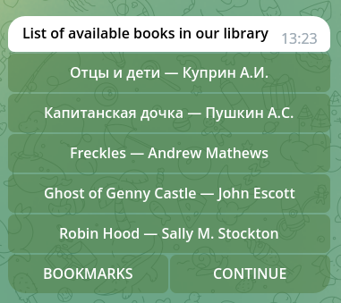
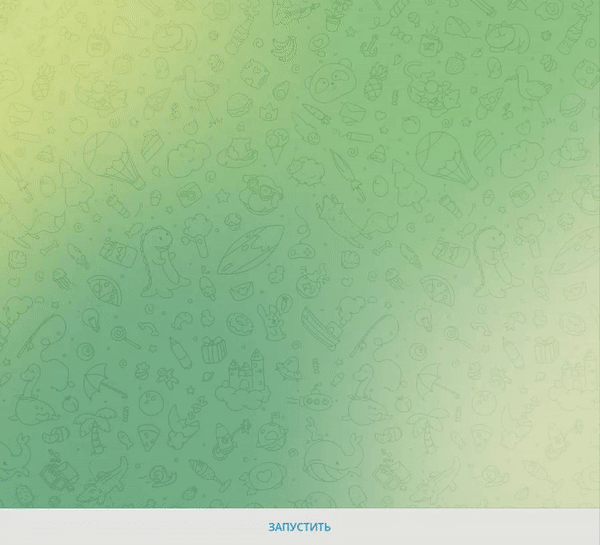

# 
TELEGRAM BOT BOOK👾
  

While reading a course on creating telegram bots, I saw a comment from the person who created the telegram bot sea battle. I also wanted to create my own bot, but using modern technologies, libraries, databases and optimization.

## Description

My project is a full-fledged bot created to read books directly from telegram. You can select a book, flip through the pages, go to the table of contents and select the desired page there, add pages to bookmarks, click on them and delete them. There are also convenient commands for going to the beginning of the book or continuing reading from the place where you finished.

